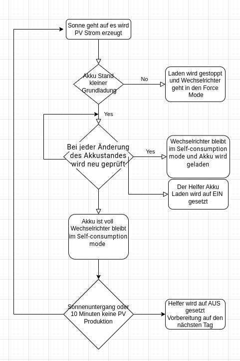

# Sungrow Homeassistent PV Load Automation

Diese Automation steuert den Ladevorgang eines Sungrow SH10RT-20 um das Akku möglichst Netzdienlich zu laden. 

Vorrausetzungen

-> Sungrow Wehselrichter Einbindung per Modebus mit der mkaiser Integration
    Quelle https://github.com/mkaiser/Sungrow-SHx-Inverter-Modbus-Home-Assistant
    Anleitung https://youtu.be/1Ag35KQM5fM?si=n3hq3-OXY3R_QmRI
    
-> PV Forcast Integration zur Ermittlung der Vorhersage des zu erwartenden PV Ertrages
    Quelle -> https://github.com/BJReplay/ha-solcast-solar
    Anleitung ->  https://youtu.be/GKJ96-WoyG0?si=9yUtBgFlLwt7pDuP

Es werden 2 Automationnen benutzt. 
In der Hauptautomation läuft die Steuerung das Ladens nach Zeit oder Prognose. 
Eine 2te Hilfsautomation wird benötigt im den Helfer Sensor zu aktualisieren. Da sich die zu grunde liegenden Werte nicht ändern muss der Sensor aktiv aktualsiert werden. 

Ablaufdiagram

TEST