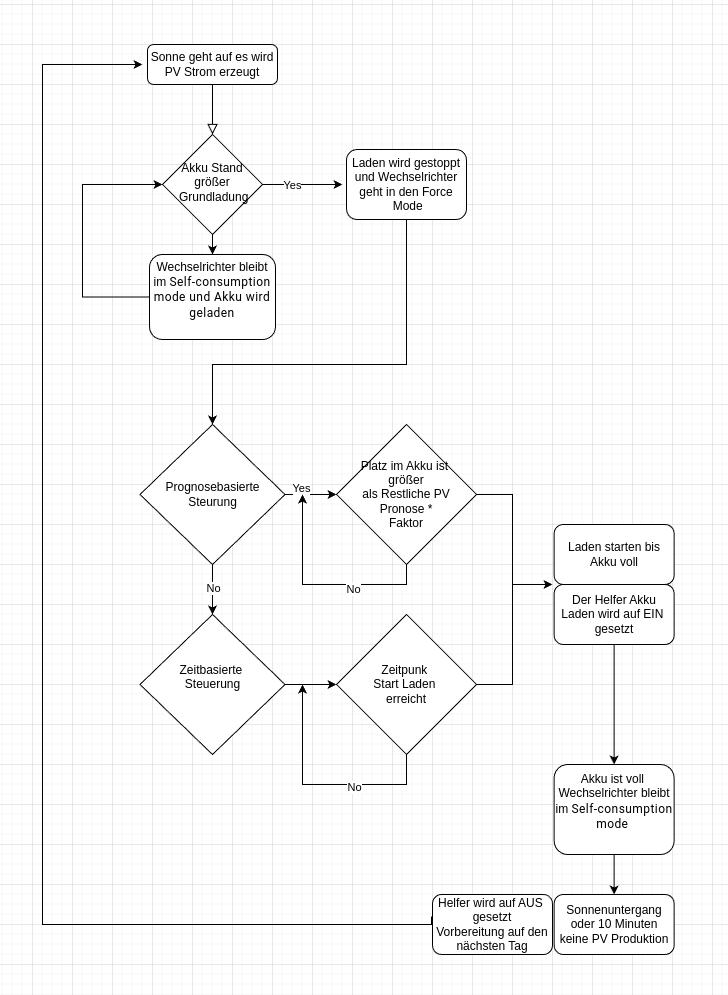
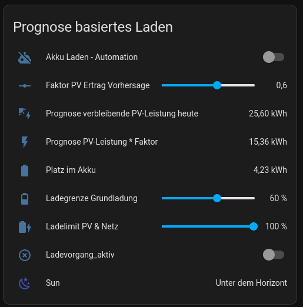

# Sungrow Home Assistant PV Load Automation

Diese Automation steuert den Ladevorgang eines Sungrow SH10RT-20, um das Akku möglichst netzdienlich zu laden.

## Voraussetzungen

### Sungrow Wechselrichter Einbindung per Modbus mit der mkaiser Integration  
**Quelle:**  
<https://github.com/mkaiser/Sungrow-SHx-Inverter-Modbus-Home-Assistant>  

**Anleitung:**  
<https://youtu.be/1Ag35KQM5fM?si=n3hq3-OXY3R_QmRI>  

### PV Forecast Integration zur Ermittlung der Vorhersage des zu erwartenden PV-Ertrages  
**Quelle:**  
<https://github.com/BJReplay/ha-solcast-solar>  

**Anleitung:**  
<https://youtu.be/GKJ96-WoyG0?si=9yUtBgFlLwt7pDuP>  

## Automationen

Es werden **zwei Automationen** benutzt:

1. Die **Hauptautomation** steuert das Laden nach Zeit oder Prognose.  
2. Eine **Hilfsautomation** wird benötigt, um den Helfer-Sensor zu aktualisieren, da sich die zugrunde liegenden Werte nicht automatisch ändern.  

## Ablaufdiagramm  
  

## Dashbord Prognose in Homeassistent

## Dashbord Zeitsteuerung

